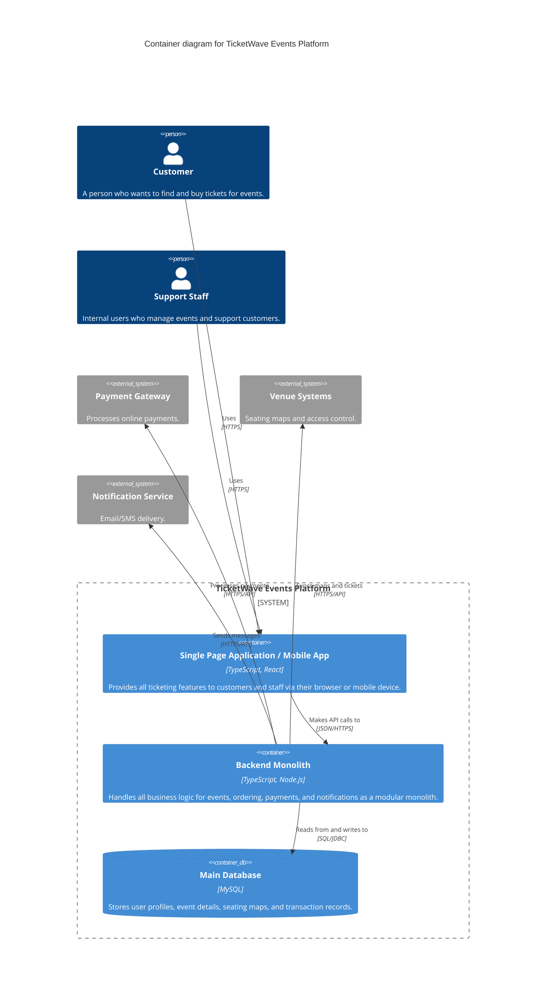

### Level 2: Container Diagram

```mermaid
C4Container
    title Container diagram for TicketWave Events Platform

    Person(customer, "Customer", "A person who wants to find and buy tickets for events.")
    Person(staff, "Support Staff", "Internal users who manage events and support customers.")

    System_Boundary(ticketwave_boundary, "TicketWave Events Platform") {
        Container(spa, "Single Page Application / Mobile App", "TypeScript, React", "Provides all ticketing features to customers and staff via their browser or mobile device.")
        Container(api, "Backend Monolith", "TypeScript, Node.js", "Handles all business logic for events, ordering, payments, and notifications as a modular monolith.")
        ContainerDb(database, "Main Database", "MySQL", "Stores user profiles, event details, seating maps, and transaction records.")
    }

    System_Ext(payment, "Payment Gateway", "Processes online payments.")
    System_Ext(venue, "Venue Systems", "Seating maps and access control.")
    System_Ext(notifications, "Notification Service", "Email/SMS delivery.")

    Rel(customer, spa, "Uses", "HTTPS")
    Rel(staff, spa, "Uses", "HTTPS")

    Rel(spa, api, "Makes API calls to", "JSON/HTTPS")
    Rel(api, database, "Reads from and writes to", "SQL/JDBC")

    Rel(api, payment, "Processes payments", "HTTPS/API")
    Rel(api, venue, "Syncs maps and tickets", "HTTPS/API")
    Rel(api, notifications, "Sends messages", "HTTPS/API")
```
