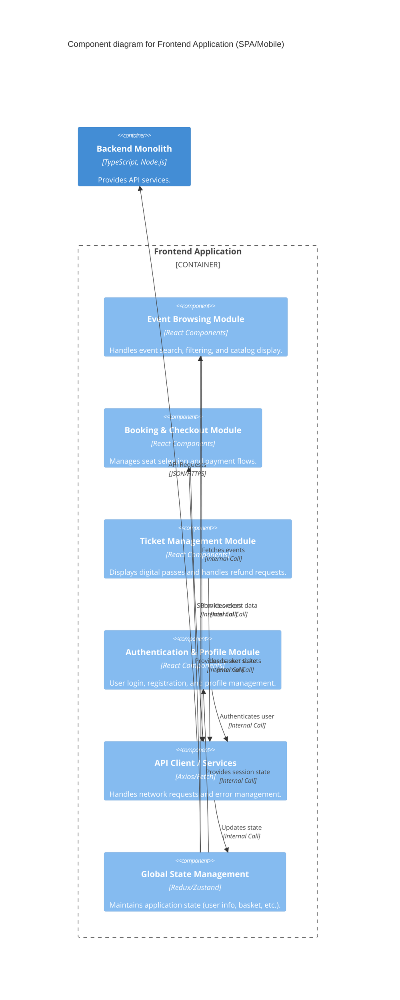

### Level 3: Component Diagram (Frontend Application)

```mermaid
C4Component
    title Component diagram for Frontend Application (SPA/Mobile)

    Container(api, "Backend Monolith", "TypeScript, Node.js", "Provides API services.")

    Container_Boundary(frontend, "Frontend Application") {
        Component(browsing, "Event Browsing Module", "React Components", "Handles event search, filtering, and catalog display.")
        Component(checkout, "Booking & Checkout Module", "React Components", "Manages seat selection and payment flows.")
        Component(tickets, "Ticket Management Module", "React Components", "Displays digital passes and handles refund requests.")
        Component(auth_ui, "Authentication & Profile Module", "React Components", "User login, registration, and profile management.")
        Component(api_client, "API Client / Services", "Axios/Fetch", "Handles network requests and error management.")
        Component(store, "Global State Management", "Redux/Zustand", "Maintains application state (user info, basket, etc.).")
    }

    Rel(browsing, api_client, "Fetches events", "Internal Call")
    Rel(checkout, api_client, "Submits orders", "Internal Call")
    Rel(tickets, api_client, "Loads user tickets", "Internal Call")
    Rel(auth_ui, api_client, "Authenticates user", "Internal Call")

    Rel(api_client, api, "API Requests", "JSON/HTTPS")
    
    Rel(api_client, store, "Updates state", "Internal Call")
    Rel(store, browsing, "Provides event data", "Internal Call")
    Rel(store, checkout, "Provides basket state", "Internal Call")
    Rel(store, auth_ui, "Provides session state", "Internal Call")
```
