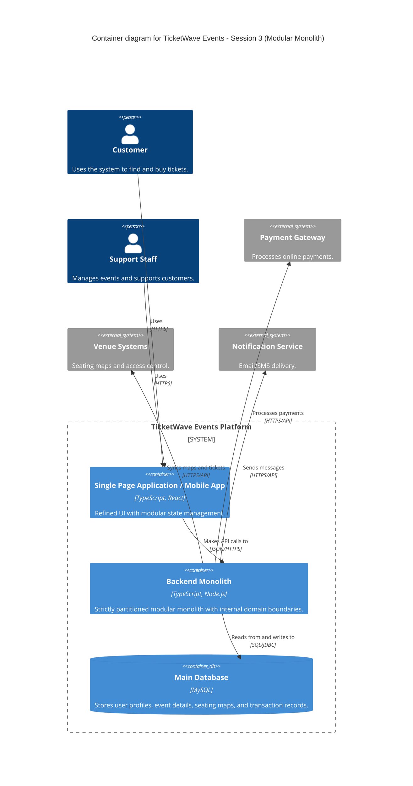

### Level 2: Container Diagram (Refined Monolith)

```mermaid
C4Container
    title Container diagram for TicketWave Events - Session 3 (Modular Monolith)

    Person(customer, "Customer", "Uses the system to find and buy tickets.")
    Person(staff, "Support Staff", "Manages events and supports customers.")

    System_Boundary(ticketwave_boundary, "TicketWave Events Platform") {
        Container(spa, "Single Page Application / Mobile App", "TypeScript, React", "Refined UI with modular state management.")
        Container(api, "Backend Monolith", "TypeScript, Node.js", "Strictly partitioned modular monolith with internal domain boundaries.")
        ContainerDb(database, "Main Database", "MySQL", "Stores user profiles, event details, seating maps, and transaction records.")
    }

    System_Ext(payment, "Payment Gateway", "Processes online payments.")
    System_Ext(venue, "Venue Systems", "Seating maps and access control.")
    System_Ext(notifications, "Notification Service", "Email/SMS delivery.")

    Rel(customer, spa, "Uses", "HTTPS")
    Rel(staff, spa, "Uses", "HTTPS")

    Rel(spa, api, "Makes API calls to", "JSON/HTTPS")
    Rel(api, database, "Reads from and writes to", "SQL/JDBC")

    Rel(api, payment, "Processes payments", "HTTPS/API")
    Rel(api, venue, "Syncs maps and tickets", "HTTPS/API")
    Rel(api, notifications, "Sends messages", "HTTPS/API")
```
