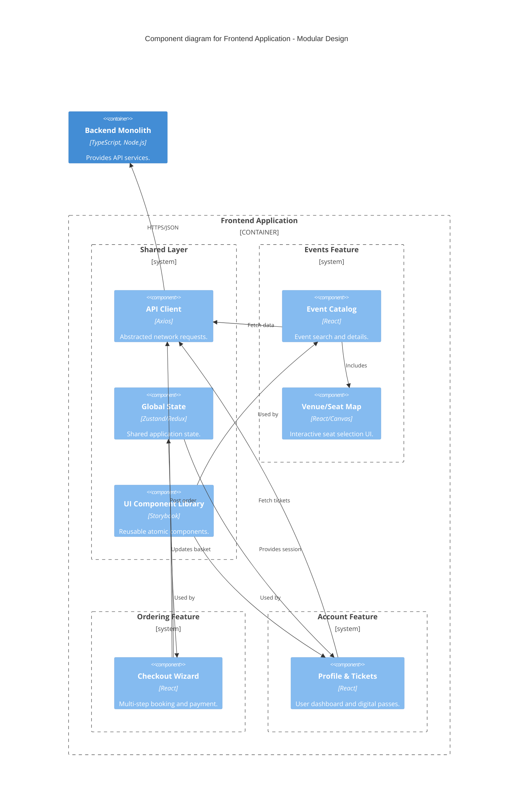

### Level 3: Component Diagram (Refined Frontend Application)

```mermaid
C4Component
    title Component diagram for Frontend Application - Modular Design

    Container(api, "Backend Monolith", "TypeScript, Node.js", "Provides API services.")

    Container_Boundary(frontend, "Frontend Application") {
        
        Boundary(shared_layer, "Shared Layer") {
            Component(api_client, "API Client", "Axios", "Abstracted network requests.")
            Component(state_store, "Global State", "Zustand/Redux", "Shared application state.")
            Component(ui_kit, "UI Component Library", "Storybook", "Reusable atomic components.")
        }

        Boundary(feature_events, "Events Feature") {
            Component(event_browsing, "Event Catalog", "React", "Event search and details.")
            Component(venue_viewer, "Venue/Seat Map", "React/Canvas", "Interactive seat selection UI.")
        }

        Boundary(feature_ordering, "Ordering Feature") {
            Component(checkout_flow, "Checkout Wizard", "React", "Multi-step booking and payment.")
        }

        Boundary(feature_account, "Account Feature") {
            Component(profile_mgmt, "Profile & Tickets", "React", "User dashboard and digital passes.")
        }
    }

    Rel(event_browsing, api_client, "Fetch data")
    Rel(checkout_flow, api_client, "Post order")
    Rel(profile_mgmt, api_client, "Fetch tickets")
    
    Rel(api_client, api, "HTTPS/JSON")
    
    Rel(event_browsing, venue_viewer, "Includes")
    Rel(checkout_flow, state_store, "Updates basket")
    Rel(state_store, profile_mgmt, "Provides session")
    
    Rel(ui_kit, event_browsing, "Used by")
    Rel(ui_kit, checkout_flow, "Used by")
    Rel(ui_kit, profile_mgmt, "Used by")
```
