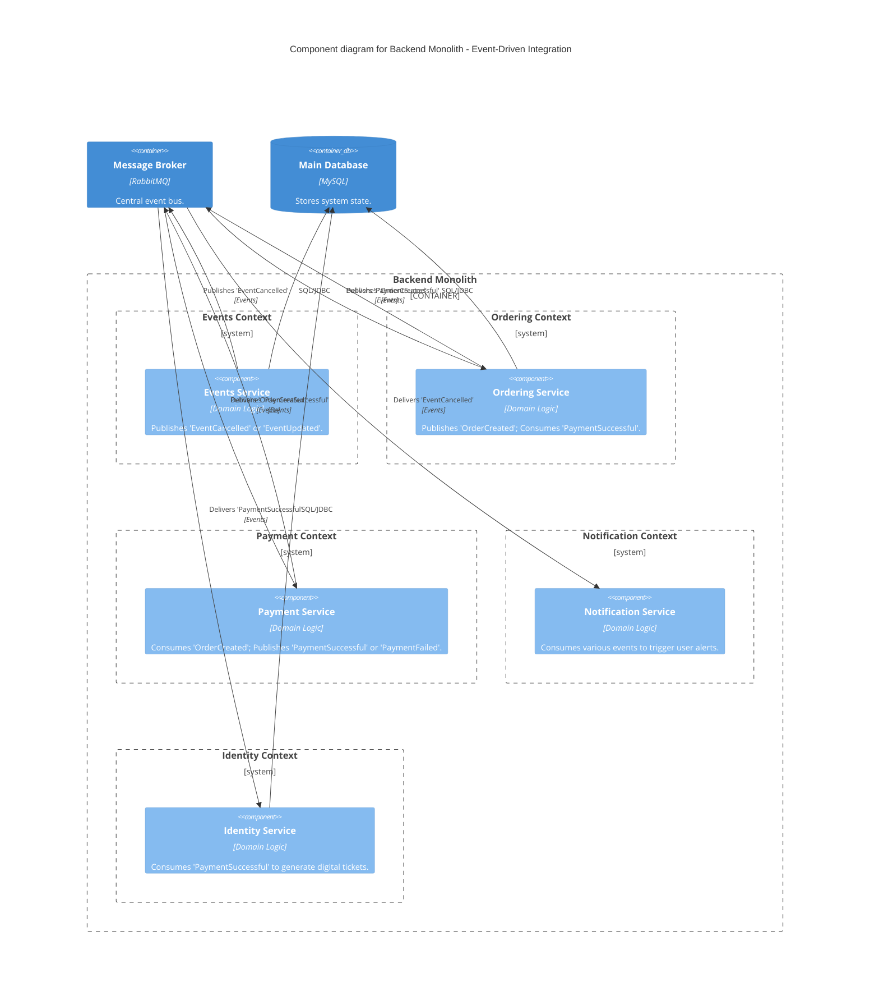

### Level 3: Component Diagram (Event-Driven Backend)

```mermaid
C4Component
    title Component diagram for Backend Monolith - Event-Driven Integration

    Container(broker, "Message Broker", "RabbitMQ", "Central event bus.")
    ContainerDb(database, "Main Database", "MySQL", "Stores system state.")

    Container_Boundary(monolith, "Backend Monolith") {
        
        Boundary(events_context, "Events Context") {
            Component(events_svc, "Events Service", "Domain Logic", "Publishes 'EventCancelled' or 'EventUpdated'.")
        }

        Boundary(ordering_context, "Ordering Context") {
            Component(ordering_svc, "Ordering Service", "Domain Logic", "Publishes 'OrderCreated'; Consumes 'PaymentSuccessful'.")
        }

        Boundary(payment_context, "Payment Context") {
            Component(payment_svc, "Payment Service", "Domain Logic", "Consumes 'OrderCreated'; Publishes 'PaymentSuccessful' or 'PaymentFailed'.")
        }

        Boundary(notif_context, "Notification Context") {
            Component(notif_svc, "Notification Service", "Domain Logic", "Consumes various events to trigger user alerts.")
        }

        Boundary(identity_context, "Identity Context") {
            Component(identity_svc, "Identity Service", "Domain Logic", "Consumes 'PaymentSuccessful' to generate digital tickets.")
        }
    }

    Rel(ordering_svc, broker, "Publishes 'OrderCreated'", "Events")
    Rel(broker, payment_svc, "Delivers 'OrderCreated'", "Events")
    
    Rel(payment_svc, broker, "Publishes 'PaymentSuccessful'", "Events")
    Rel(broker, ordering_svc, "Delivers 'PaymentSuccessful'", "Events")
    Rel(broker, identity_svc, "Delivers 'PaymentSuccessful'", "Events")
    Rel(broker, notif_svc, "Delivers 'PaymentSuccessful'", "Events")

    Rel(events_svc, broker, "Publishes 'EventCancelled'", "Events")
    Rel(broker, notif_svc, "Delivers 'EventCancelled'", "Events")

    Rel(identity_svc, database, "SQL/JDBC")
    Rel(events_svc, database, "SQL/JDBC")
    Rel(ordering_svc, database, "SQL/JDBC")
```
