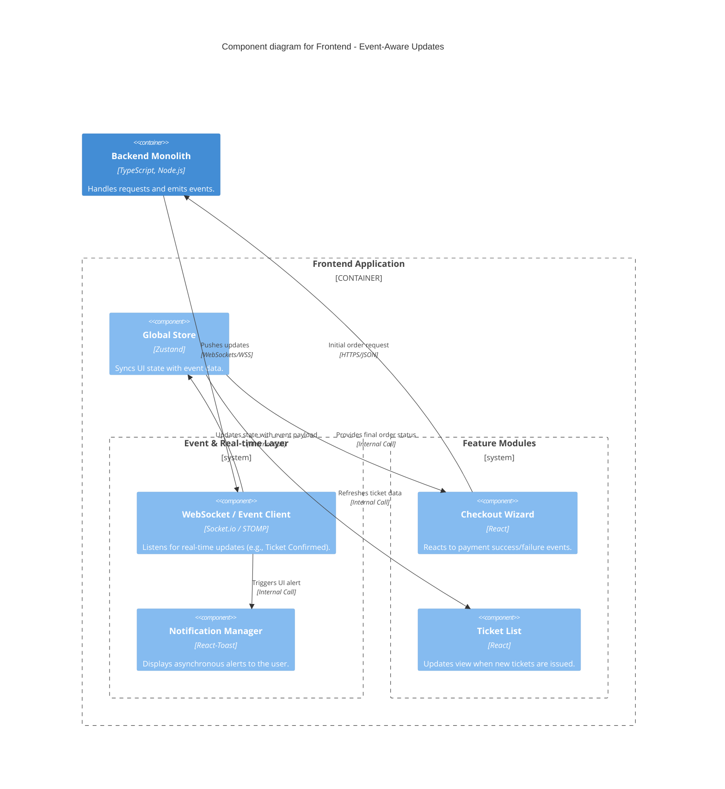

### Level 3: Component Diagram (Event-Aware Frontend)

```mermaid
C4Component
    title Component diagram for Frontend - Event-Aware Updates

    Container(api, "Backend Monolith", "TypeScript, Node.js", "Handles requests and emits events.")

    Container_Boundary(frontend, "Frontend Application") {
        
        Boundary(event_layer, "Event & Real-time Layer") {
            Component(socket_client, "WebSocket / Event Client", "Socket.io / STOMP", "Listens for real-time updates (e.g., Ticket Confirmed).")
            Component(toast_manager, "Notification Manager", "React-Toast", "Displays asynchronous alerts to the user.")
        }

        Boundary(features, "Feature Modules") {
            Component(checkout, "Checkout Wizard", "React", "Reacts to payment success/failure events.")
            Component(ticket_list, "Ticket List", "React", "Updates view when new tickets are issued.")
        }

        Component(state_store, "Global Store", "Zustand", "Syncs UI state with event data.")
    }

    Rel(api, socket_client, "Pushes updates", "WebSockets/WSS")
    
    Rel(socket_client, state_store, "Updates state with event payload", "Internal Call")
    Rel(socket_client, toast_manager, "Triggers UI alert", "Internal Call")
    
    Rel(state_store, checkout, "Provides final order status", "Internal Call")
    Rel(state_store, ticket_list, "Refreshes ticket data", "Internal Call")

    Rel(checkout, api, "Initial order request", "HTTPS/JSON")
```
