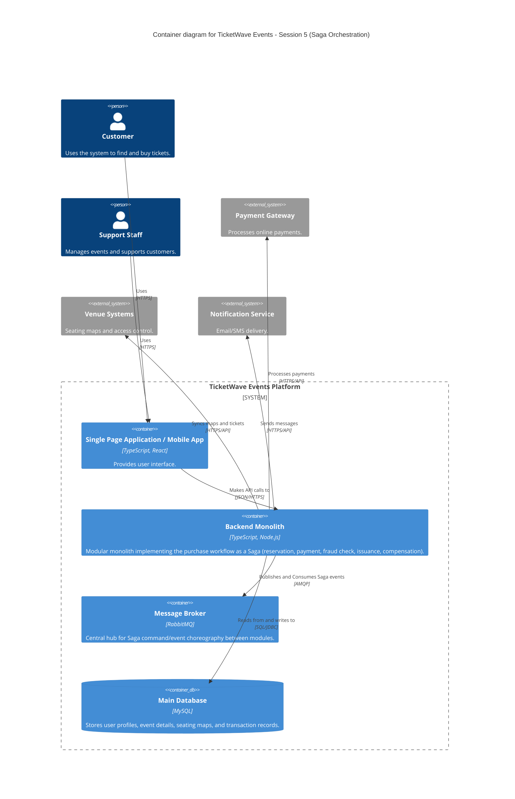

### Level 2: Container Diagram (Saga Orchestration)

**Note:** No API Gateway container yet. The single client entry point is introduced in Session 7 —
see the Session 7 models and the corresponding note in `CLAUDE.md`'s deviations section for why this
was corrected after initially appearing here.
