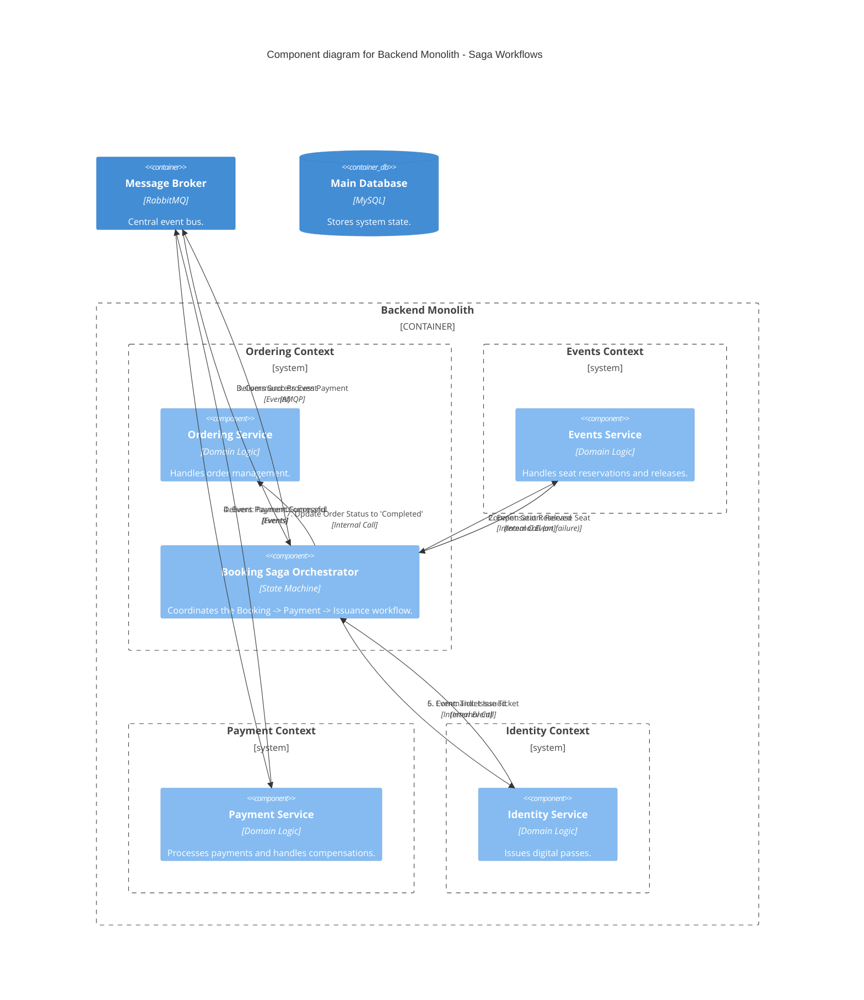

### Level 3: Component Diagram (Saga Orchestration)

```mermaid
C4Component
    title Component diagram for Backend Monolith - Saga Workflows

    Container(broker, "Message Broker", "RabbitMQ", "Central event bus.")
    ContainerDb(database, "Main Database", "MySQL", "Stores system state.")

    Container_Boundary(monolith, "Backend Monolith") {
        
        Boundary(ordering_context, "Ordering Context") {
            Component(ordering_svc, "Ordering Service", "Domain Logic", "Handles order management.")
            Component(saga_orchestrator, "Booking Saga Orchestrator", "State Machine", "Coordinates the Booking -> Payment -> Issuance workflow.")
        }

        Boundary(events_context, "Events Context") {
            Component(events_svc, "Events Service", "Domain Logic", "Handles seat reservations and releases.")
        }

        Boundary(payment_context, "Payment Context") {
            Component(payment_svc, "Payment Service", "Domain Logic", "Processes payments and handles compensations.")
        }

        Boundary(identity_context, "Identity Context") {
            Component(identity_svc, "Identity Service", "Domain Logic", "Issues digital passes.")
        }
    }

    Rel(saga_orchestrator, events_svc, "1. Command: Reserve Seat", "Internal Call")
    Rel(events_svc, saga_orchestrator, "2. Event: Seat Reserved", "Internal Event")
    
    Rel(saga_orchestrator, broker, "3. Command: Process Payment", "AMQP")
    Rel(broker, payment_svc, "Delivers Payment Command", "Events")
    
    Rel(payment_svc, broker, "4. Event: Payment Successful", "Events")
    Rel(broker, saga_orchestrator, "Delivers Success Event", "Events")
    
    Rel(saga_orchestrator, identity_svc, "5. Command: Issue Ticket", "Internal Call")
    Rel(identity_svc, saga_orchestrator, "6. Event: Ticket Issued", "Internal Event")

    Rel(saga_orchestrator, ordering_svc, "7. Update Order Status to 'Completed'", "Internal Call")
    
    Rel(saga_orchestrator, events_svc, "Compensation: Release Seat", "Internal Call (on failure)")
```
