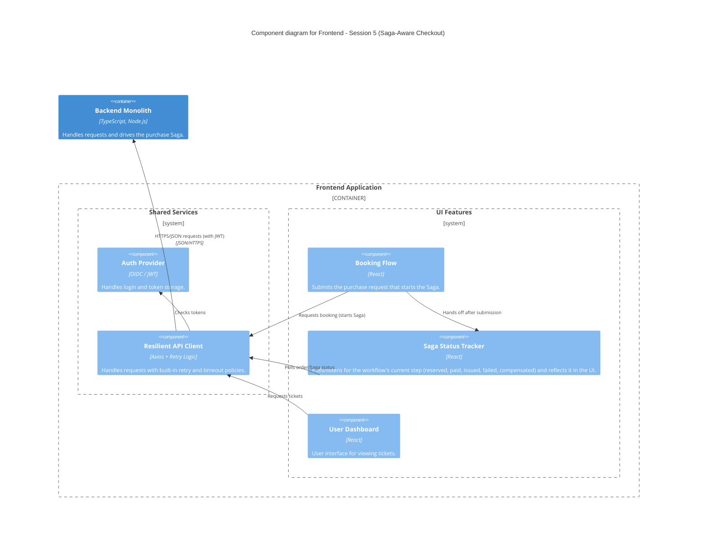

### Level 3: Component Diagram (Frontend - Saga-Aware Checkout)

**Note:** No API Gateway container yet — the client talks to the Backend Monolith directly. The
single client entry point is introduced in Session 7.
