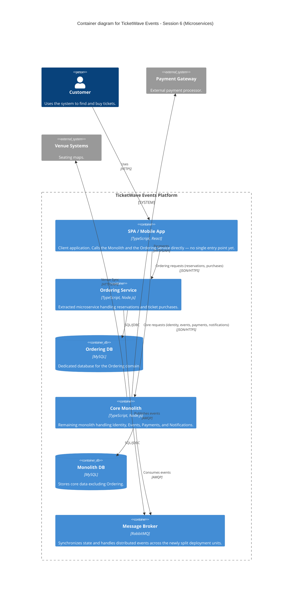

### Level 2: Container Diagram (Microservices Extraction)

**Note:** No API Gateway yet. Per the Session 6 academic focus (splitting the monolith, bounded
contexts, data isolation, independent deployment), the client calls each deployment unit directly —
the single client entry point is introduced in Session 7.
