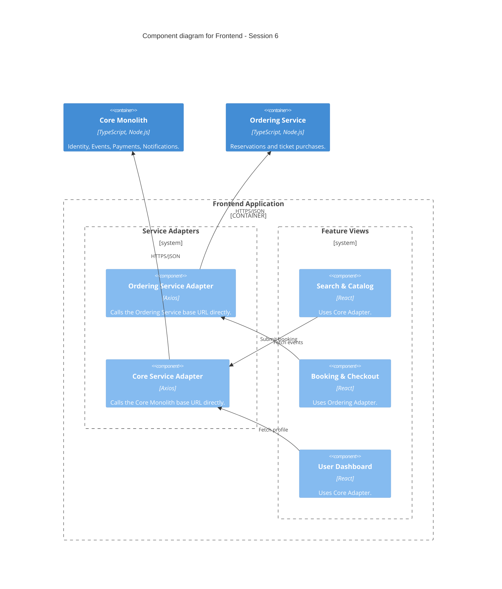

### Level 3: Component Diagram (Frontend - Microservices Era)

**Note:** No API Gateway yet — each adapter targets its service's own base URL. Session 7 introduces
a single Gateway entry point that both adapters will route through instead.
