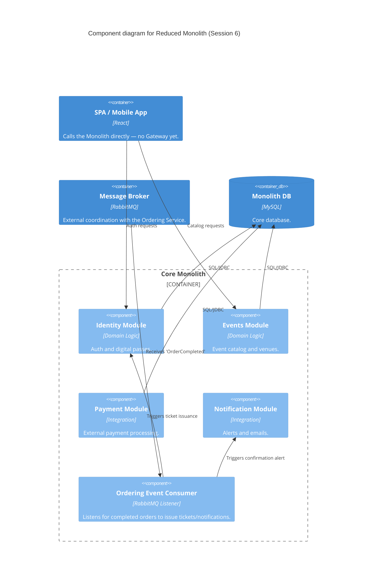

### Level 3: Component Diagram (Reduced Monolith)

```mermaid
C4Component
    title Component diagram for Reduced Monolith (Session 6)

    Container(spa, "SPA / Mobile App", "React", "Calls the Monolith directly — no Gateway yet.")
    Container(broker, "Message Broker", "RabbitMQ", "External coordination with the Ordering Service.")
    ContainerDb(db, "Monolith DB", "MySQL", "Core database.")

    Container_Boundary(monolith, "Core Monolith") {
        Component(identity, "Identity Module", "Domain Logic", "Auth and digital passes.")
        Component(events, "Events Module", "Domain Logic", "Event catalog and venues.")
        Component(payments, "Payment Module", "Integration", "External payment processing.")
        Component(notifs, "Notification Module", "Integration", "Alerts and emails.")

        Component(order_sync, "Ordering Event Consumer", "RabbitMQ Listener", "Listens for completed orders to issue tickets/notifications.")
    }

    Rel(spa, identity, "Auth requests")
    Rel(spa, events, "Catalog requests")

    Rel(broker, order_sync, "Receives 'OrderCompleted'")
    Rel(order_sync, identity, "Triggers ticket issuance")
    Rel(order_sync, notifs, "Triggers confirmation alert")

    Rel(identity, db, "SQL/JDBC")
    Rel(events, db, "SQL/JDBC")
    Rel(payments, db, "SQL/JDBC")
```

**Note:** No API Gateway yet — the SPA calls this monolith's endpoints directly.
