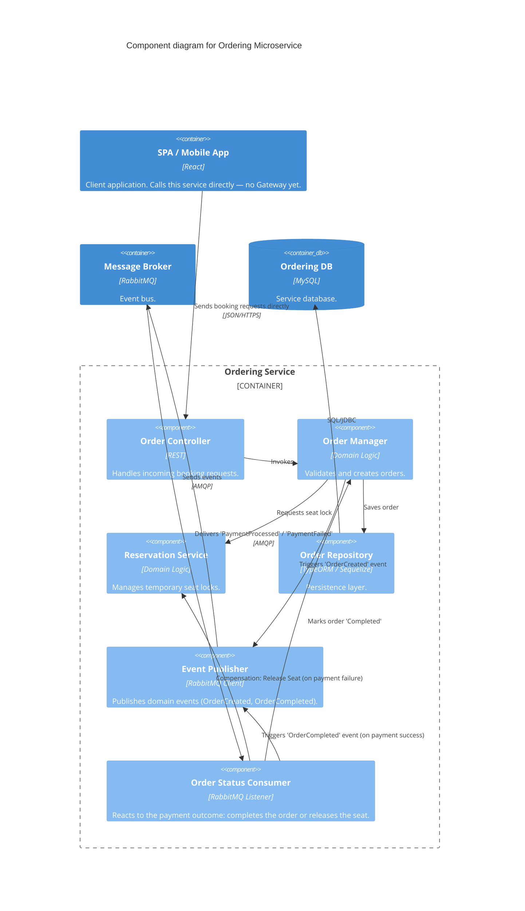

### Level 3: Component Diagram (Ordering Microservice)

**Note:** No API Gateway yet — the client calls this service's own base URL directly.

**Delta from Session 5 — orchestration becomes choreography:** the single in-process Booking Saga
Orchestrator doesn't survive this session's extraction into two independently deployable services — an
orchestrator can't make synchronous in-process calls across a service boundary without reintroducing
the coupling the extraction was meant to remove. Coordination is now choreographed over `broker`: this
service publishes `OrderCreated`, the Monolith's Fraud Check Module reacts first and gates the
Payment Module (which charges the customer and publishes `PaymentProcessed`/`PaymentFailed`, or the
Fraud Check Module itself publishes `PaymentFailed` on a fraud rejection — see
`level-3-components-monolith-backend.md`), and the `Order Status Consumer` here reacts to that
outcome — completing the order (whose `OrderCompleted`
event the Monolith's `Ordering Event Consumer` still consumes for ticket issuance/notification, as
before) or compensating by releasing the seat. This is a consequence of the extraction, not a
preference for choreography over orchestration.
