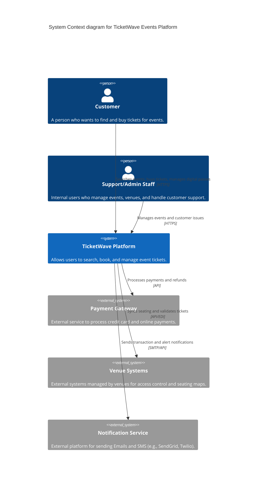

### Level 1: System Context Diagram

_Unchanged since Session 2 — carried forward per the C4 modeling rule (copy even when the model does not change)._

```mermaid
C4Context
    title System Context diagram for TicketWave Events Platform

    Person(customer, "Customer", "A person who wants to find and buy tickets for events.")
    Person(staff, "Support/Admin Staff", "Internal users who manage events, venues, and handle customer support.")

    System(ticketwave, "TicketWave Platform", "Allows users to search, book, and manage event tickets.")

    System_Ext(payment, "Payment Gateway", "External service to process credit card and online payments.")
    System_Ext(venue, "Venue Systems", "External systems managed by venues for access control and seating maps.")
    System_Ext(notifications, "Notification Service", "External platform for sending Emails and SMS (e.g., SendGrid, Twilio).")

    Rel(customer, ticketwave, "Searches events, buys tickets, manages digital passes", "HTTPS")
    Rel(staff, ticketwave, "Manages events and customer issues", "HTTPS")

    Rel(ticketwave, payment, "Processes payments and refunds", "API")
    Rel(ticketwave, venue, "Syncs seating and validates tickets", "API/EDI")
    Rel(ticketwave, notifications, "Sends transaction and alert notifications", "SMTP/API")

    UpdateLayoutConfig($c4ShapeInRow="3", $c4BoundaryInRow="1")
```
