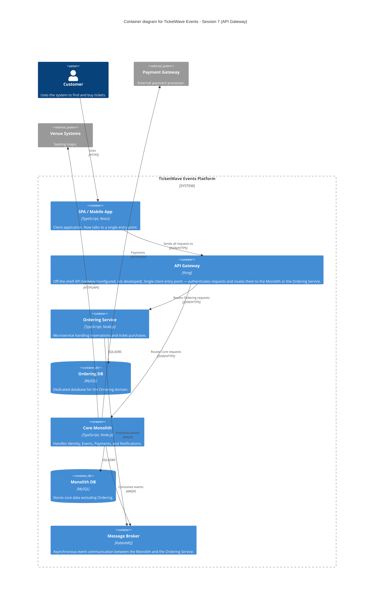

### Level 2: Container Diagram (API Gateway)

**Architectural delta from Session 6:** the client no longer calls the Monolith and the Ordering
Service directly. All traffic now enters through the API Gateway, which is the only container the SPA
talks to. Routing, authentication, and rate limiting move from being (implicitly) the client's concern
to being the Gateway's responsibility — see `level-3-components-gateway.md` for its internals.
RabbitMQ continues to carry asynchronous domain events between the two backend deployment units,
unaffected by the Gateway's introduction.
