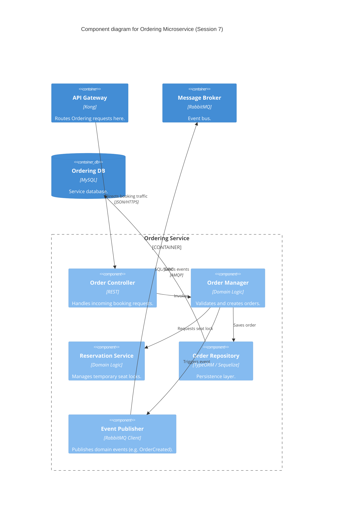

### Level 3: Component Diagram (Ordering Microservice)

**Architectural delta from Session 6:** internal domain logic is unchanged — only the caller changed,
from the SPA directly to the API Gateway.
