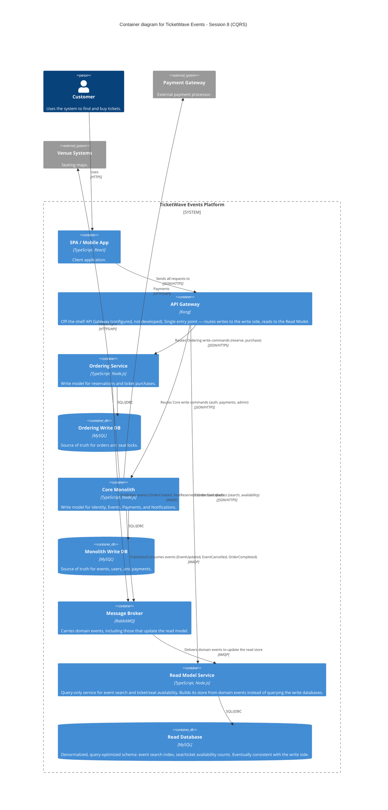

### Level 2: Container Diagram (CQRS Read Model)

**Architectural delta from Session 7:** a new Read Model Service and Read Database appear, fed
asynchronously through RabbitMQ instead of being queried directly from the write-side databases. The
Gateway now splits traffic by intent — commands still go to the Monolith or the Ordering Service;
event-search and availability queries go to the Read Model. `monolith_db` and `ordering_db` remain the
sources of truth (write model); `read_db` is a derived, eventually-consistent projection (read model).

**Why CQRS here and not elsewhere:** event search, event availability, and seat/ticket availability are
exactly the read-heavy, spike-prone workloads called out for this session — the same on-sale traffic
spikes described in `ticketwave-events.md`. Splitting them out means a flood of read traffic during a
popular on-sale no longer contends with the Ordering Service's write path (seat reservation), which was
already the system's most contention-sensitive part and the reason it was extracted first, in Session 6.
Nothing else in the system gets a read/write split — there's no workload pressure that justifies it.
