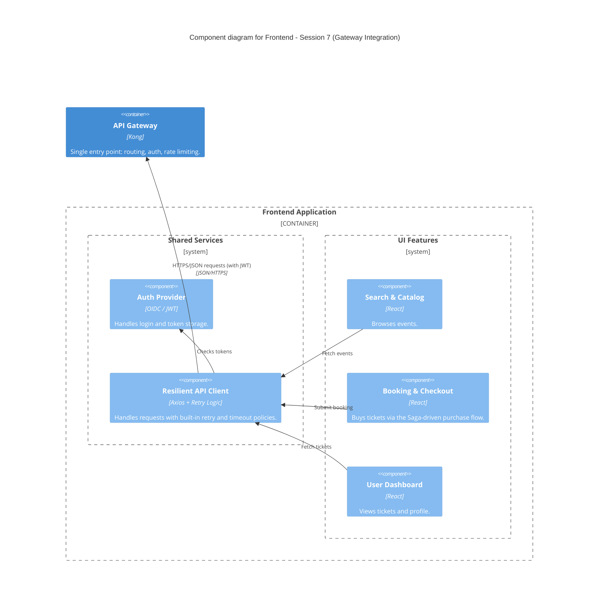

### Level 3: Component Diagram (Frontend - Gateway Integration)

_Unchanged from Session 7 — carried forward per the C4 modeling rule. The frontend still talks to a
single API Gateway and has no awareness that search/availability reads and booking writes are now
served by different backend containers; that split is entirely hidden behind the Gateway._

