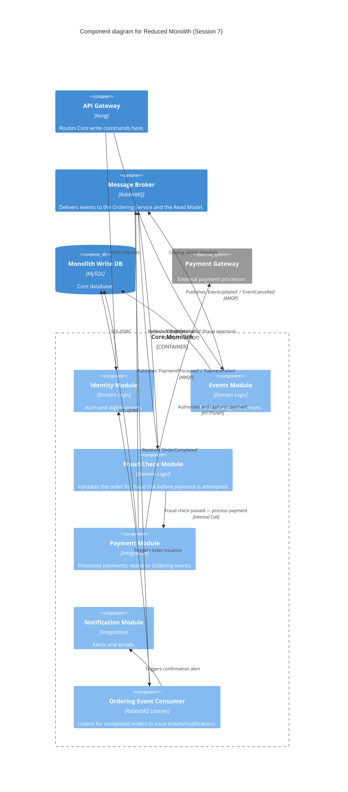

### Level 3: Component Diagram (Reduced Monolith)

_Internal structure unchanged from Session 7 — carried forward per the C4 modeling rule. The Events
Module already publishes the domain events (`EventUpdated`, `EventCancelled`) that the new Read Model
Service (see `level-3-components-read-model.md`) subscribes to; no new component was needed here to
support CQRS._

