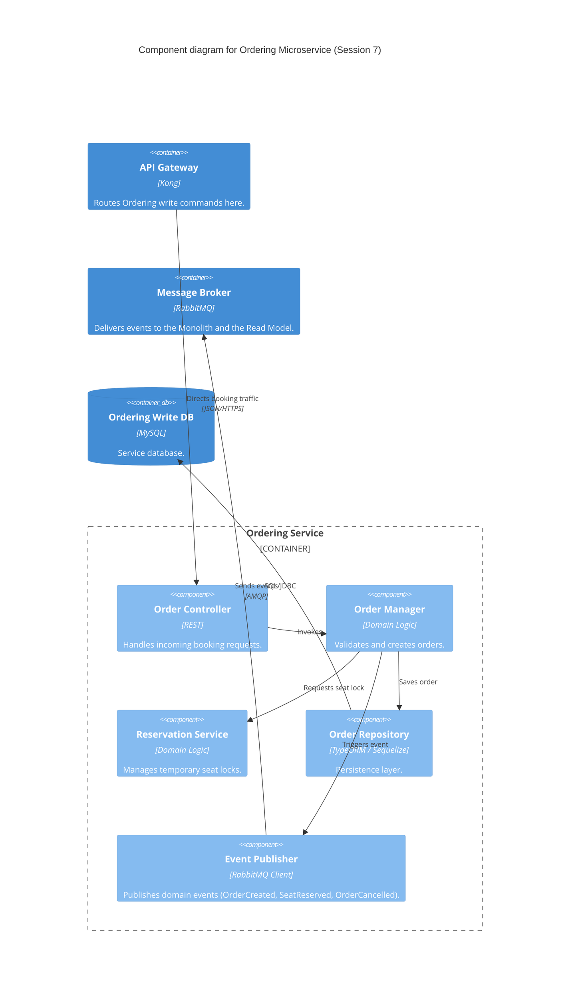

### Level 3: Component Diagram (Ordering Microservice)

_Internal structure unchanged from Session 7 — carried forward per the C4 modeling rule. The existing
`Event Publisher` already emits the events (`OrderCreated`, `SeatReserved`, `OrderCancelled`) that the
new Read Model Service consumes to keep availability counts current; no new component was needed here
to support CQRS._

