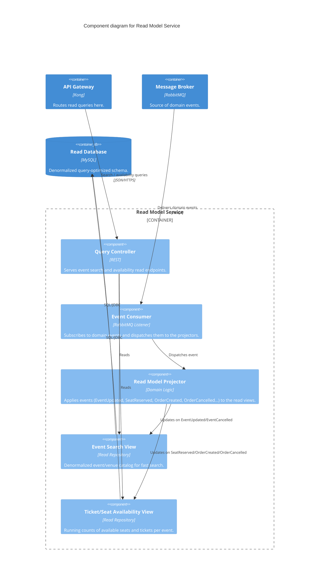

### Level 3: Component Diagram (Read Model Service)

**Consistency note:** the Read Model is intentionally eventually consistent — a seat reservation is
visible in the Ordering Service's write path immediately, but the Availability View only reflects it
once the corresponding event has been consumed off RabbitMQ and projected. This is acceptable for
search/availability display; the actual reservation is still enforced by the Ordering Service's write
path, not by anything read here.
